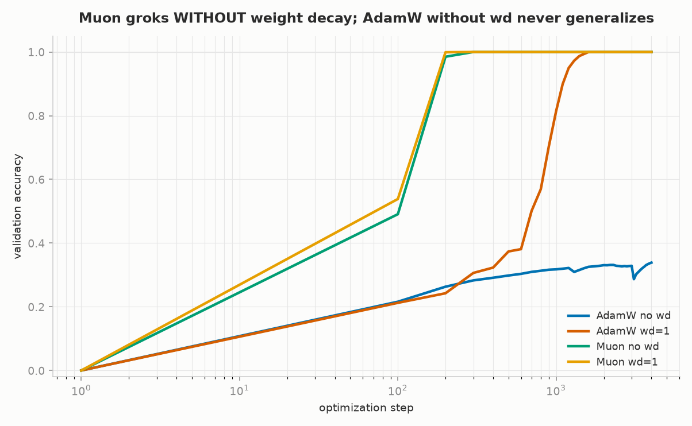
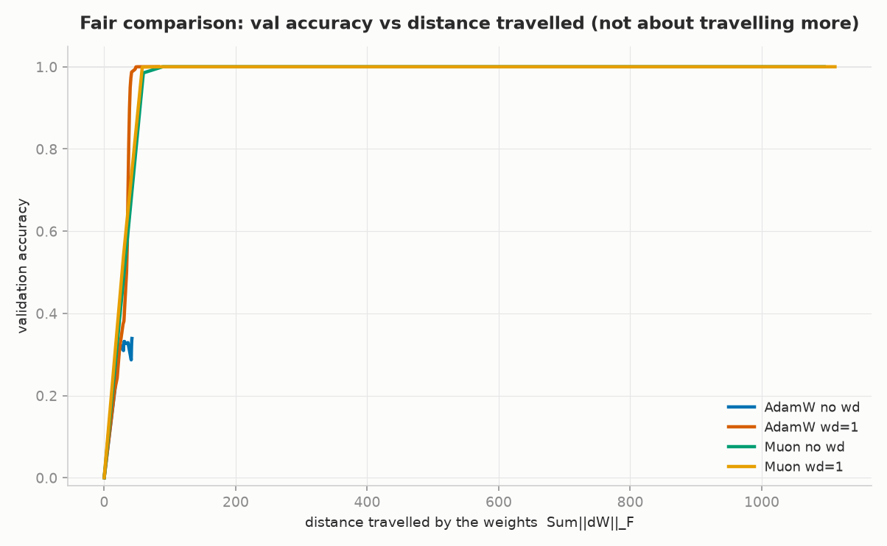
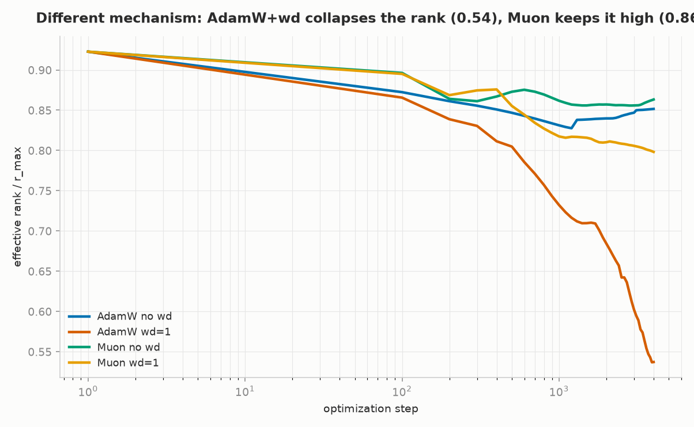
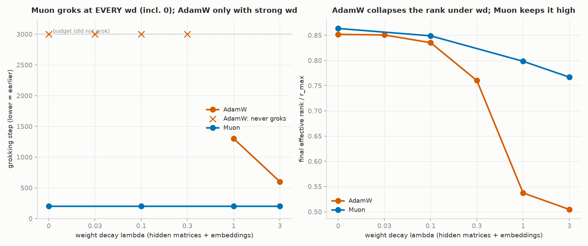
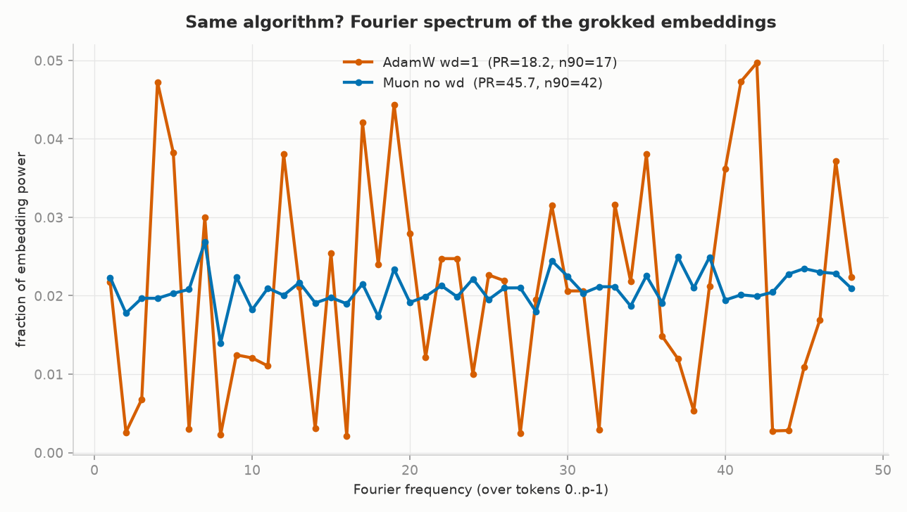

# Grokking × Muon — Muon generalizes *without* weight decay, via a different mechanism

**TL;DR.** On modular addition `(a+b) mod 97`, a tiny transformer trained with **AdamW** only
generalizes ("groks") when weight decay is strong (λ ≳ 1), and it does so by **collapsing the
weight spectrum to low effective rank**. The **Muon** optimizer groks **at every weight decay,
including zero**, in a fixed ~200 steps, while keeping effective rank **high**. The reason is
mechanistic: AdamW+wd learns a **sparse Fourier** algorithm (~16 key frequencies); Muon learns a
**distributed Fourier** solution using **almost all 48 frequencies uniformly**. Muon's orthogonalized
update flattens the spectrum *by construction*, so it lands on a dense generalizing solution without
needing the sparsity pressure that weight decay gives AdamW. Robust across 3 seeds.

> Tiny-scale study (p=97, 1 layer, ~210K params). It is a clean, controlled *nano* result, not a
> claim about frontier models. See [Limitations](#limitations).

---

## The question

Grokking (Power et al. 2022) — train accuracy saturates early, validation accuracy stays flat for a
long time and then suddenly jumps to 100% — is usually attributed to **weight decay** pushing the
network toward a *simpler* solution. But [Muon](https://kellerjordan.github.io/posts/muon/) (Jordan
2024) doesn't penalize weight norm at all: it **orthogonalizes** the update (changes its *geometry*).

So: **can Muon grok without weight decay, and if so, by what mechanism?** We isolate two hypotheses:

1. Grokking is driven mainly by weight decay (a norm-reduction pressure toward simplicity).
2. Muon's update geometry induces generalization by itself.

## Setup

- **Task.** `c = (a+b) mod p`, `p=97`. Input sequence `[a, b, '=']` (the `=` token has id `p`); the
  model predicts `c` at the last position. Full-batch gradient descent. A fraction `frac` of the
  `p²` pairs is training data, the rest is held out.
- **Model.** The same nanoGPT used across this repo (`model.py`), configured tiny: 1 layer, 4 heads,
  `n_embd=128`, no dropout, no bias (~210K params). The optimizer is the lab's Muon (`muon.py`).
- **Instrumentation** (`harness.py`). Per checkpoint we record: train/val accuracy and loss, the
  **weight travel** `Σ‖ΔW‖_F` and relative travel, the **effective rank** of the hidden matrices
  (entropy of the singular values, SVD on CPU), Frobenius / spectral norm, cosine between successive
  updates, and the logit margin. Formal metrics: `mem_step` (train ≥ 0.99), `gen_step` (val ≥ 0.95
  **and stays**), grok delay, and the **area between the train/val curves**. No eyeballing the "click".

### Fair play (this matters)

- `--wd λ` applies the **same** decoupled shrink (`lr_ref · λ`) in *both* optimizers. Muon carries no
  weight decay, so for the Muon arm we apply the shrink by hand using the **same reference lr** as
  AdamW — `muon.py` stays untouched. (An early version scaled Muon's shrink by `muon_lr`, making its
  wd 10× stronger; that confound is fixed.)
- Muon moves the weights **further per step**, so "groks in fewer steps" could be an artifact. We
  therefore also plot validation accuracy against **distance travelled in weight space**, not just
  against steps.

## Results

### 1. Muon groks without weight decay; AdamW without wd never does

At `frac=0.30`, 3 seeds:

| arm | grok step (s1 / s2 / s3) | final effective rank | groks? |
|---|---|---|---|
| **A · AdamW no wd** | none / none / none | ~0.85 (no collapse) | **never** |
| **B · AdamW wd=1** | 1300 / 1500 / 600 | 0.54 / 0.65 / 0.60 (**collapses**) | late, high variance |
| **C · Muon no wd** | **200 / 200 / 200** | 0.86 / 0.86 / 0.86 (**high**) | fast, deterministic |
| **D · Muon wd=1** | 200 / 200 / 200 | ~0.80 | fast |



**It is not because Muon travels further.** AdamW-without-wd travels a *larger* distance in weight
space (≈70) than Muon (≈60) and still never groks — so it is the **direction/geometry** of the update,
not the distance. (In *steps* Muon wins by moving more per step; in *distance* AdamW+wd is actually the
most efficient grokker. The travel plot prevents the naive over-claim.)



### 2. Two spectrally different mechanisms

AdamW+wd generalizes by **collapsing** the effective rank (0.85 → 0.54) — the classic "simpler
solution". Muon generalizes while **keeping the rank high** (~0.86), with no collapse.



### 3. Phase diagram: Muon is unconditional, AdamW has a threshold

Sweeping weight decay: AdamW does not grok until `wd ≳ 1`; Muon groks in ~200 steps at **every** wd,
including 0. Effective rank tracks wd for AdamW (collapses to ~0.50) but stays high for Muon (~0.77 even
at wd=3).



### 4. What is Muon's high-rank solution? Distributed Fourier

Modular-addition grokking is known to learn a **Fourier-multiplication** algorithm whose token
embeddings concentrate on a few *key frequencies* (Nanda et al., *Progress measures for grokking*). We
take the DFT of the learned embeddings. Across 3 seeds, both arms reach val = 1.00, but:

- **AdamW wd=1** — **sparse** Fourier: participation ratio **17.7**, ~16 key frequencies, and the
  chosen subset **changes with the seed**.
- **Muon no wd** — **distributed** Fourier: participation ratio **45.7**, ~42 of 48 frequencies with
  near-uniform power, and it is **seed-invariant** (it uses almost all of them every time).



This closes the loop with the effective-rank finding: **low rank = sparse Fourier (AdamW); high rank =
distributed Fourier (Muon)**. Muon's orthogonalization flattens the singular spectrum by construction,
so it lands on a dense, all-frequencies solution that already generalizes — without needing the
sparsity pressure that weight decay provides to AdamW. It is also a clean **counterexample to
"grokking = collapse to a low-rank/simple solution"**: Muon generalizes perfectly at high rank.

*(The averaged spectrum figure slightly understates AdamW's sparsity because each seed peaks on
different frequencies; the per-seed participation ratio of 17.7 is the robust measure.)*

## Limitations

- Nano scale: `p=97`, 1 layer, ~210K params. Not verified at LM scale.
- `muon_lr=0.01` is fixed (not swept).
- **Novelty not verified.** The Muon×grokking interaction and the rank-preservation mechanism appear
  under-characterized, but I have not done an exhaustive literature check — treat this as a clean,
  reproducible observation, not a novelty claim.

## Reproduce

```bash
pip install torch numpy matplotlib
# core 2x2 (frac 0.3), full budget, fine geometry — writes results/curves/*.csv
bash run.sh
# figures from the curves
python plot.py  --tags A_adamw_nowd B_adamw_wd C_muon_nowd D_muon_wd \
                --labels "AdamW no wd" "AdamW wd=1" "Muon no wd" "Muon wd=1" \
                --y val_acc --x step --logx --out figures/g1_val_step.png
python phase.py --out figures/g4_phase.png
python fourier.py --steps 2500 --seeds 1337 2 3 --out figures/g5_fourier.png
```

Runs on Apple Silicon (MPS), CUDA, or CPU (`--device`). SVDs are always taken on CPU. Deterministic per
seed.

## Files

| file | what |
|---|---|
| `harness.py` | immutable instrument: task, training, geometry probes, formal metrics |
| `phase.py` | weight-decay phase diagram (grok step + effective rank) |
| `fourier.py` | DFT of the grokked embeddings (sparse vs distributed) |
| `plot.py` | flexible curve plotter |
| `run.sh` | reproduce the core arms |
| `model.py`, `muon.py` | dependencies (nanoGPT + Muon), included so the folder runs standalone |
| `results/` | raw per-run curves (`curves/*.csv`) and the autoresearch journal (`results.tsv`) |
| `figures/` | the charts above |

## Credits

- `model.py` — [nanoGPT](https://github.com/karpathy/nanoGPT) by Andrej Karpathy (MIT).
- `muon.py` — [Muon](https://kellerjordan.github.io/posts/muon/) by Keller Jordan (didactic single-GPU port).
- Grokking task & Fourier analysis — Power et al. 2022; Nanda et al., *Progress measures for grokking
  via mechanistic interpretability*.
